# Visualizaciones del Proyecto — Los Clasificados Recomendadores

Este folder contiene el script `visualizaciones.py` que genera todas las gráficas del proyecto. Los resultados se guardan automáticamente en `visuals_results/`.

Las visualizaciones están organizadas en tres bloques: **Análisis Exploratorio del Dataset**, **Evaluación de Modelos Supervisados** y **Clustering No Supervisado**.

---

## Análisis Exploratorio del Dataset

### 1. Overview del Dataset
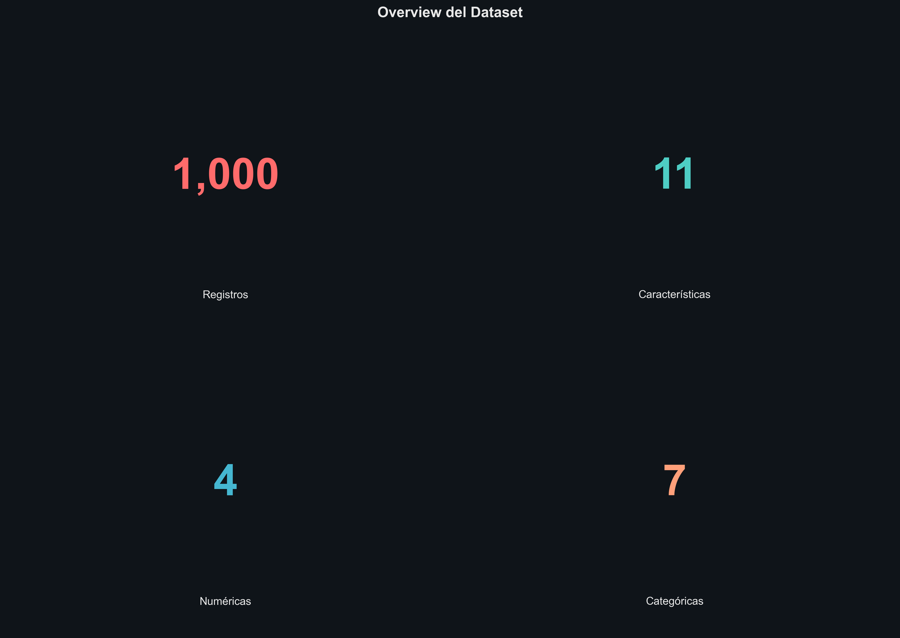

Cuadro de resumen con los 4 números más importantes del dataset: **1,000 registros**, **11 características en total**, **4 variables numéricas** y **7 variables categóricas**.

El dataset tiene un tamaño razonable para los modelos que entrenamos. Con 1,000 registros y clases perfectamente balanceadas (200 por clase en cada target), las métricas de accuracy son directamente interpretables sin necesidad de técnicas de balanceo como SMOTE. La división 4 numéricas / 7 categóricas también explica por qué se usó encoding en el preprocesamiento, ya que la mayoría de las variables que describen a los usuarios son categóricas (preferencias de contenido, velocidad de lectura, etc.).

---

### 2. Distribuciones de Variables Numéricas
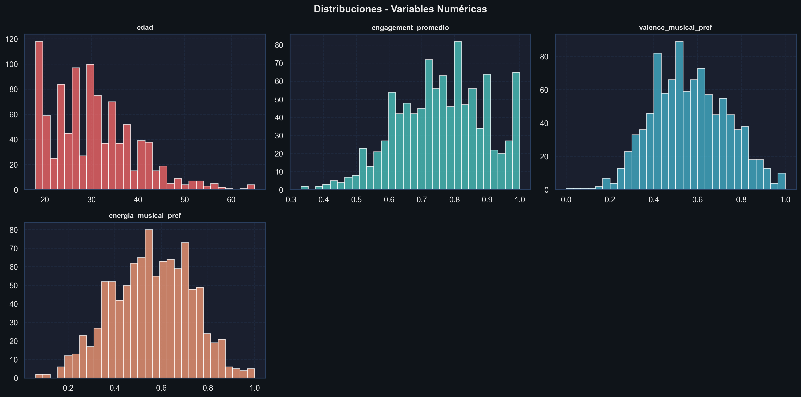

Histogramas de las 4 variables numéricas del dataset.

- **`edad`**: Distribución claramente sesgada a la derecha. La gran mayoría de usuarios tienen entre 20 y 35 años, con muy pocos por encima de los 50. Esto indica que el dataset representa principalmente adultos jóvenes, lo cual puede influir en los patrones de recomendación (por ejemplo, preferencias musicales o de series).

- **`engagement_promedio`**: Distribución bastante uniforme entre 0.4 y 1.0, con un ligero aumento hacia valores altos. La mayoría de usuarios tiene engagement moderado-alto, lo que sugiere que el dataset no incluye usuarios completamente inactivos.

- **`valence_musical_pref`**: Distribución aproximadamente uniforme entre 0 y 1, con cierto acumulamiento en valores medios (0.4–0.7). La valencia musical mide qué tan "positiva" es la música que prefiere el usuario; el hecho de que esté distribuida uniformemente indica diversidad en los gustos del dataset.

- **`energia_musical_pref`**: Forma de campana centrada alrededor de 0.5–0.6. Esto indica que la mayoría de los usuarios prefieren música de energía media, y los extremos (muy tranquila o muy intensa) son menos comunes.

---

### 3. Distribuciones de Variables Categóricas
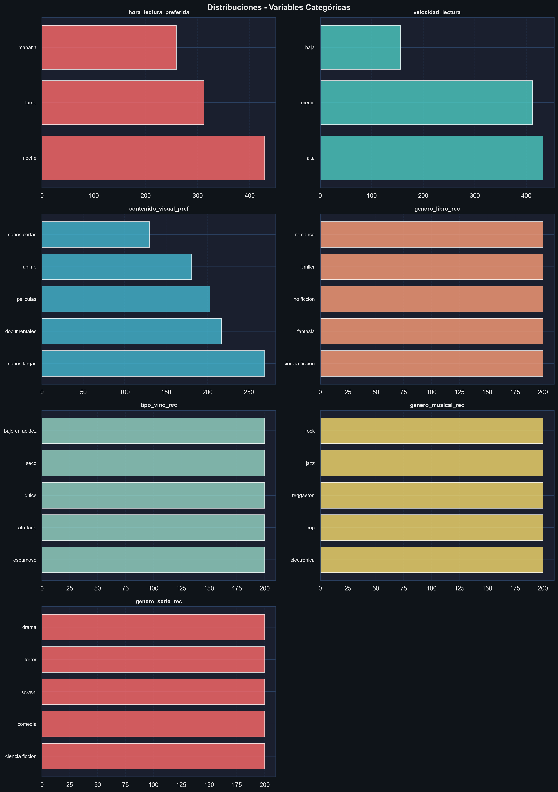

Barras horizontales para todas las variables categóricas.

- **`hora_lectura_preferida`**: La noche es el horario preferido (~420 usuarios), seguida de la tarde (~320) y la mañana (~260). Tiene sentido considerando que el dataset representa adultos jóvenes que probablemente trabajan o estudian durante el día.

- **`velocidad_lectura`**: Distribución bastante pareja entre alta, media y baja, aunque "alta" tiene una leve ventaja (~420 usuarios). No hay un perfil dominante de lector, lo que enriquece la diversidad del dataset.

- **`contenido_visual_pref`**: Las series largas son el tipo de contenido preferido (~255 usuarios), seguidas de películas (~215), documentales (~175) y anime (~165). Las series cortas son las menos populares. Este patrón refleja tendencias de consumo actuales donde el binge-watching de series largas domina.

- **Los 4 targets** (`genero_libro_rec`, `tipo_vino_rec`, `genero_musical_rec`, `genero_serie_rec`): Todos tienen exactamente **200 registros por clase**, lo cual es un dataset perfectamente balanceado. Esto es ideal porque los modelos no tendrán sesgo hacia ninguna clase y la accuracy es una métrica directamente válida.

---

### 4. Matriz de Correlación
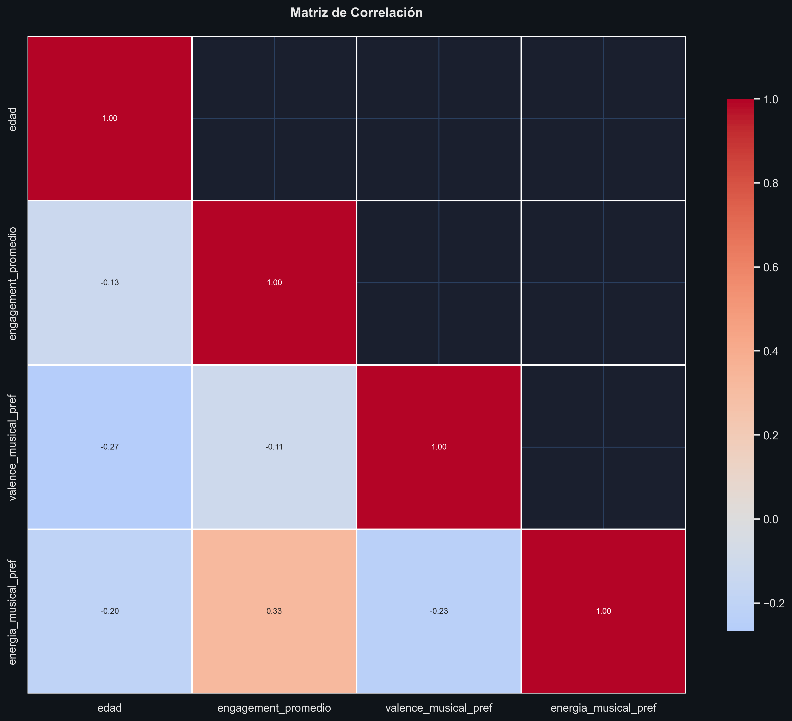

Heatmap con las correlaciones entre las 4 variables numéricas (triángulo inferior).

Lo más destacable es que **las correlaciones son generalmente bajas**, lo que indica que las variables aportan información independiente al modelo, sin multicolinealidad problemática:

- **`engagement_promedio` y `energia_musical_pref` (0.33)**: Esta es la correlación más alta del dataset. Tiene sentido intuitivo: usuarios más comprometidos con el contenido tienden a preferir música más energética. Sin embargo, 0.33 sigue siendo una correlación moderada-baja, por lo que ambas variables siguen siendo útiles de forma independiente.

- **`edad` y `valence_musical_pref` (-0.27)**: Correlación negativa, lo que sugiere que usuarios más mayores tienden a preferir música con valencia más baja (menos "feliz" o eufórica). También tiene lógica: el gusto musical cambia con la edad.

- **`edad` y `energia_musical_pref` (-0.20)**: También negativa. Los usuarios mayores prefieren música menos energética, lo cual es consistente con la correlación anterior.

- **`valence_musical_pref` y `energia_musical_pref` (-0.23)**: Negativa y moderada. En este dataset la música positiva no necesariamente es energética (por ejemplo, música acústica alegre vs. reggaeton).

En general, la baja correlación entre variables es una buena señal para los modelos: ninguna variable es redundante.

---

### 5. Distribución de Targets
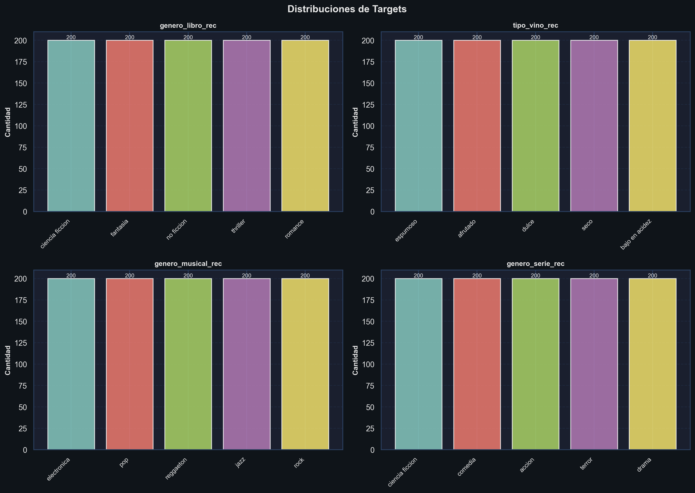

Conteo por clase para los 4 recomendadores del proyecto.

El dataset tiene **200 registros exactos por clase** en los 4 targets. Esto no es casualidad: el dataset fue construido con balance intencional. Las implicaciones son:

- La **accuracy es una métrica válida** directamente (sin necesidad de ajustar por desbalance).
- Los modelos tienen la misma cantidad de ejemplos de entrenamiento para cada clase, lo que evita que aprendan a predecir siempre la clase más frecuente.
- Para `genero_libro_rec`: ciencia ficción, fantasía, no ficción, thriller y romance.
- Para `tipo_vino_rec`: espumoso, afrutado, dulce, seco y bajo en acidez.
- Para `genero_musical_rec`: electrónica, pop, reggaeton, jazz y rock.
- Para `genero_serie_rec`: ciencia ficción, comedia, acción, terror y drama.

Cabe destacar que `tipo_vino_rec` resultó ser la tarea más difícil para todos los modelos (accuracies entre 0.54 y 0.66), lo que sugiere que las características del usuario no tienen una relación tan clara con la preferencia de vino como sí la tienen con música, libros o series.

---

## Evaluación de Modelos Supervisados

### 6. Árbol de Decisión — F1 por Clase
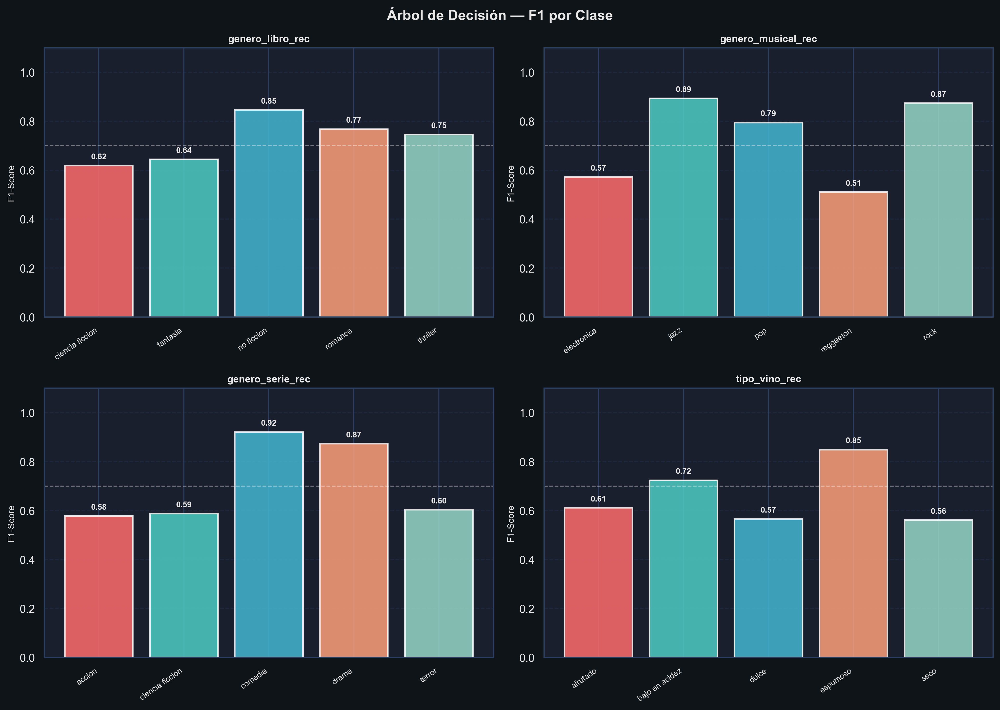

F1-Score por clase para el Árbol de Decisión en los 4 recomendadores. La línea punteada marca el umbral de 0.70.

El Árbol logra los mejores resultados generales del proyecto. Analizando por tarea:

- **`genero_libro_rec`**: `no ficcion` alcanza 0.85 y `thriller` 0.75, mientras que `ciencia ficcion` (0.62) y `fantasia` (0.64) quedan por debajo del umbral. Esto sugiere que el no ficción tiene patrones de usuario muy reconocibles, mientras que ciencia ficción se confunde con fantasía.

- **`genero_musical_rec`**: `jazz` (0.89) y `rock` (0.87) son las clases más fáciles de predecir. `reggaeton` (0.51) y `electronica` (0.57) son las más difíciles, posiblemente porque los usuarios de estos géneros comparten características similares con otros.

- **`genero_serie_rec`**: El modelo tiene excelente desempeño en `comedia` (0.92) y `drama` (0.87), pero falla en `accion` (0.58) y `ciencia ficcion` (0.59). Las series de acción y sci-fi pueden compartir el mismo perfil de usuario.

- **`tipo_vino_rec`**: La tarea más difícil. Solo `espumoso` (0.85) destaca claramente. `dulce` (0.57), `seco` (0.56) y `afrutado` (0.61) quedan por debajo del umbral. Los tipos de vino tienen fronteras de decisión menos claras en función de las características disponibles.

---

### 7. Regresión Logística — F1 por Clase
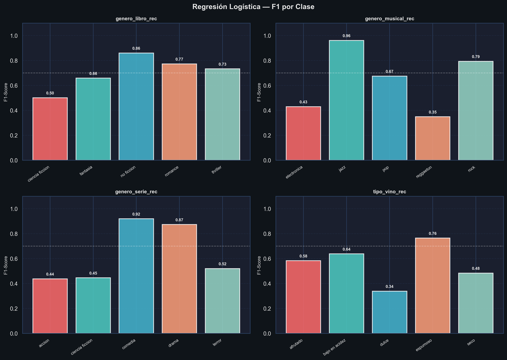

F1-Score por clase para la Regresión Logística.

Este modelo presenta la **mayor varianza entre clases** de todos los modelos evaluados, lo cual es su característica más notable:

- Tiene el **mejor F1 individual del proyecto**: `jazz` en `genero_musical_rec` con **0.96**. Es el único modelo que supera el 0.90 en música.
- Sin embargo, también tiene los peores valores: `reggaeton` (0.35) es el F1 más bajo visto en todo el proyecto para música, y `ciencia ficcion` en `genero_serie_rec` también alcanza un preocupante 0.44.
- En `genero_libro_rec` el comportamiento es similar al Árbol, con `no ficcion` bien identificada (0.86) pero `ciencia ficcion` baja (0.50).
- Para `tipo_vino_rec`, el patrón sigue siendo difícil: `bajo en acidez` alcanza 0.34, el valor más bajo de toda la tabla para esta tarea.

La interpretación es que la Regresión Logística, siendo un modelo lineal, puede capturar muy bien las clases que tienen fronteras linealmente separables (como `jazz`), pero falla en clases que requieren fronteras más complejas.

---

### 8. Random Forest — F1 por Clase
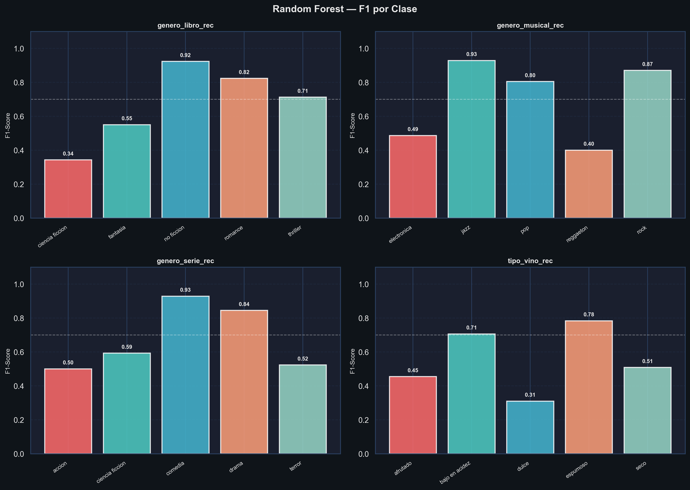

F1-Score por clase para Random Forest.

Random Forest muestra un comportamiento similar al Árbol de Decisión, con ligeras diferencias:

- **`genero_libro_rec`**: `no ficcion` destaca con 0.92 (incluso mejor que el Árbol), pero `ciencia ficcion` cae a 0.34, el valor más bajo entre los tres modelos para esta clase. El ensemble agrava el error en las clases difíciles al mismo tiempo que mejora las fáciles.

- **`genero_musical_rec`**: `jazz` (0.93) y `rock` (0.87) mantienen el buen desempeño, pero `reggaeton` sigue siendo problemático (0.40). El problema con reggaeton no es del modelo en sí, sino probablemente de que las características del dataset no diferencian bien a los usuarios de reggaeton de otros géneros.

- **`genero_serie_rec`**: `comedia` (0.93) y `drama` (0.84) son excelentes, pero `accion` (0.50) y `ciencia ficcion` (0.59) siguen siendo las más difíciles.

- **`tipo_vino_rec`**: `bajo en acidez` cae a 0.31, el valor más bajo de todo el proyecto. Random Forest no mejora la situación del vino respecto al Árbol.

---

### 9. SVM — Comparación de los 5 Kernels
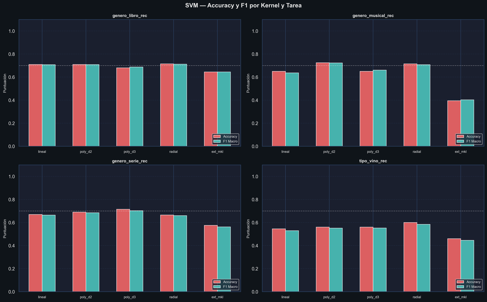

Accuracy y F1 Macro para los 5 kernels del SVM (lineal, poly_d2, poly_d3, radial, **extremality_mkl**) por cada tarea.

La inclusión del kernel `ext_mkl` revela un hallazgo importante:

- **`genero_libro_rec`**: Los kernels lineal, poly_d2 y radial son prácticamente iguales (~0.71). `ext_mkl` cae a ~0.65, siendo el peor kernel para esta tarea.

- **`genero_musical_rec`**: `poly_d2` domina claramente con 0.725. `ext_mkl` colapsa a **~0.40**, el peor resultado de toda la tabla del SVM. El kernel MKL extremal simplemente no captura los patrones de preferencia musical.

- **`genero_serie_rec`**: `poly_d3` gana con 0.715, seguido de poly_d2 (0.69). `ext_mkl` queda a ~0.58, bastante por debajo de los otros kernels.

- **`tipo_vino_rec`**: El kernel radial (0.60) es el mejor. `ext_mkl` llega a ~0.45, el valor más bajo para esta tarea entre todos los kernels.

La conclusión es que **`ext_mkl` es consistentemente el peor kernel** en este problema. Los kernels polinomial y radial son los más competitivos dependiendo de la tarea.

---

### 10. Comparación de Modelos Base
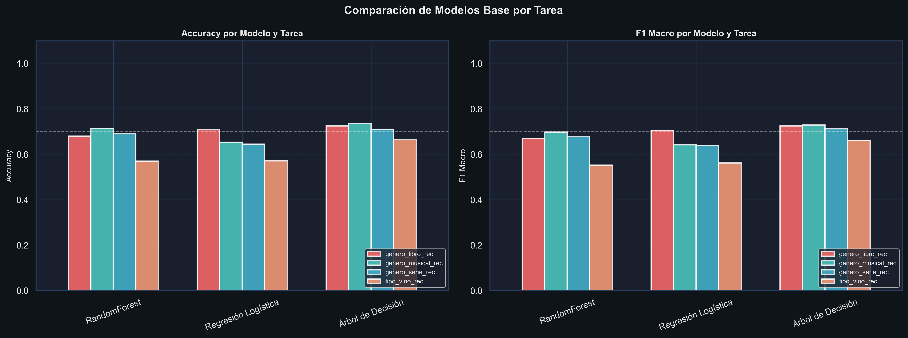

Barras agrupadas de Accuracy y F1 Macro para los 3 modelos base (RandomForest, Regresión Logística, Árbol de Decisión) en cada tarea.

Algunos patrones claros:

- **El Árbol de Decisión gana de forma consistente** en casi todas las tareas, especialmente en `genero_musical_rec` donde tiene una ventaja notable sobre los demás.
- **RandomForest queda segundo** en la mayoría de tareas. La diferencia con el Árbol es pequeña (~2-3%), lo que sugiere que el ensemble no está mejorando mucho al árbol base.
- **La Regresión Logística queda última** en `genero_musical_rec` y `genero_serie_rec`, con una caída notable frente a los modelos basados en árbol. Esto confirma que las relaciones entre características y géneros no son lineales.
- **`tipo_vino_rec` es la columna del fondo** para los tres: ningún modelo supera 0.68 en esta tarea.

---

### 11. Heatmap Global de Modelos
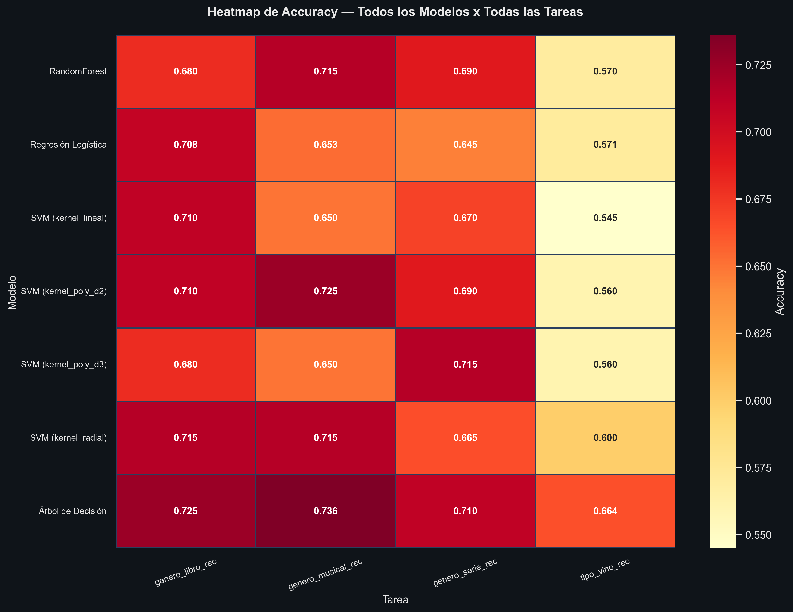

Heatmap de accuracy para **todos los modelos** (incluyendo todas las variantes del SVM) versus todas las tareas. Los colores más oscuros (rojo) indican mayor accuracy.

Este gráfico permite ver el panorama completo del proyecto de un vistazo:

- **La columna `tipo_vino_rec` es la más clara** en toda la tabla: ningún modelo supera 0.664. Visualmente contrasta mucho con las otras tareas, confirmando que predecir el tipo de vino es estructuralmente más difícil con las features disponibles.
- **El Árbol de Decisión (última fila) tiene los tonos más oscuros** en todas las columnas, siendo el ganador general del proyecto.
- **El SVM con kernel_lineal tiene los valores más bajos** en `tipo_vino_rec` (0.545) y `genero_musical_rec` (0.650).
- **`genero_musical_rec`** tiene la mayor variación entre modelos: desde 0.650 (SVM lineal y poly_d3) hasta 0.736 (Árbol), una diferencia de 8.6 puntos porcentuales.

---

### 12. Precision y Recall por Modelo
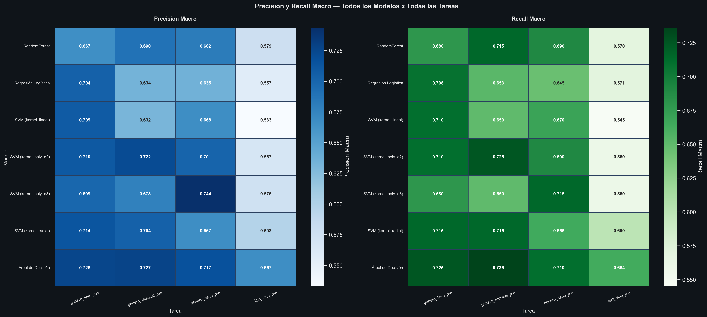

Heatmaps de **Precision Macro** (azul) y **Recall Macro** (verde) para todos los modelos y tareas. Complementan el heatmap de accuracy porque permiten ver si un modelo sacrifica una métrica por la otra.

Observaciones clave:

- **Precision y Recall son casi iguales** en la mayoría de modelos. Esto tiene sentido porque el dataset está perfectamente balanceado: con 200 muestras por clase, no hay incentivo para que el modelo sea más preciso o con más recall en ninguna dirección particular.

- **SVM poly_d3**: Tiene precision marcadamente más alta que recall en `genero_serie_rec` (0.744 precision vs 0.715 recall). Esto indica que cuando predice una clase la acierta bastante, pero a veces deja de predecirla para casos donde debería. Es un modelo "conservador".

- **El Árbol de Decisión** es el más equilibrado: precision y recall son prácticamente idénticos (0.726/0.725 en `genero_libro_rec`, 0.727/0.736 en musical). Esto lo hace el más confiable para despliegue.

- **`tipo_vino_rec`** sigue siendo la columna más pálida en ambos heatmaps, confirmando que la dificultad no es un problema de precision/recall sino de que las features simplemente no tienen suficiente señal para esta tarea.

---

### 13. Ranking de Modelos por Tarea
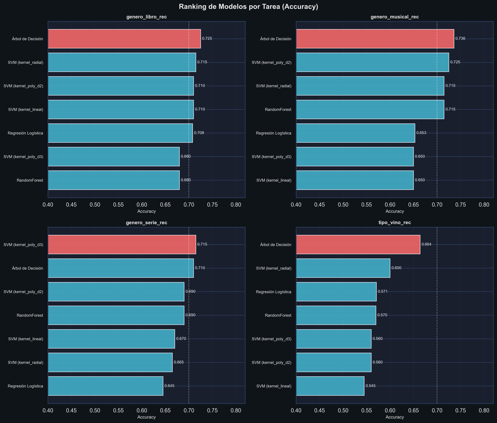

Barras horizontales con todos los modelos ordenados de menor a mayor accuracy dentro de cada tarea. La barra en rojo es el ganador.

- **`genero_libro_rec`**: El Árbol gana con 0.725, seguido muy de cerca por SVM radial (0.715) y SVM lineal/poly_d2 (0.710). La diferencia entre los 4 primeros es de apenas 1.5%, lo que sugiere que para esta tarea casi cualquier modelo bien configurado llega a resultados similares. RandomForest queda último con 0.680.

- **`genero_musical_rec`**: El Árbol gana con 0.736 y hay una brecha más pronunciada. SVM poly_d2 (0.725) es el único que se acerca. La Regresión Logística queda en el fondo con 0.653.

- **`genero_serie_rec`**: Aquí el SVM poly_d3 (0.715) empata con el Árbol (0.710). Es la única tarea donde un SVM realmente compite de igual a igual con el Árbol.

- **`tipo_vino_rec`**: El Árbol gana por un margen más claro (0.664) sobre SVM radial (0.600). Todos los modelos tienen accuracies bajas aquí.

---

### Dashboard Interactivo

Además de las imágenes estáticas, el script genera `visuals_results/14_dashboard_exploratorio.html`, un archivo interactivo que se puede abrir en el navegador. Contiene un histograma, box plot, scatter plot y distribución categórica con zoom y tooltips. Es útil para explorar el dataset de forma dinámica sin necesidad de correr código.

---

## Clustering No Supervisado

### 14. Clusters — PCA y t-SNE
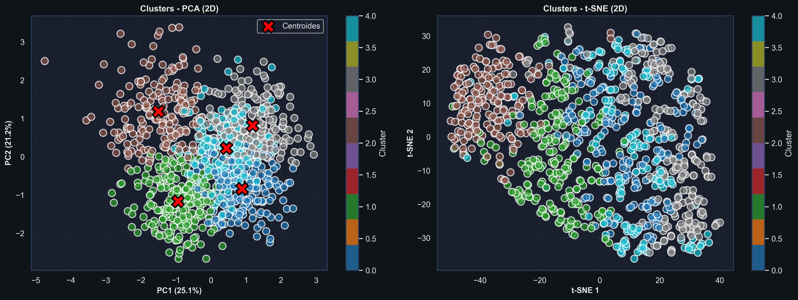

Visualización de los 5 clusters en 2D usando PCA (izquierda) y t-SNE (derecha). Los centroides están marcados con X roja.

- **PCA**: PC1 explica el 25.1% de la varianza y PC2 el 21.2%, sumando apenas un 46.3% de la varianza total. Esto significa que proyectar a 2D pierde más de la mitad de la información, por lo que el solapamiento visible entre clusters es en parte una limitación de la reducción de dimensionalidad, no necesariamente que los clusters estén mal definidos en el espacio original de 15 features.

- **t-SNE**: A diferencia del PCA, el t-SNE optimiza para preservar las distancias locales, no globales. Se pueden ver algunas agrupaciones más compactas, pero sigue habiendo solapamiento considerable entre clusters vecinos.

- **Interpretación del solapamiento**: El Silhouette Score de 0.12 confirma que los clusters no están muy bien separados. Esto es esperable dado que estamos agrupando preferencias culturales (música, lectura, series) que naturalmente tienen transiciones graduales, no fronteras duras. Los clusters representan perfiles generales de usuario, no segmentos perfectamente distintos.

---

### 15. Distribución de Clusters
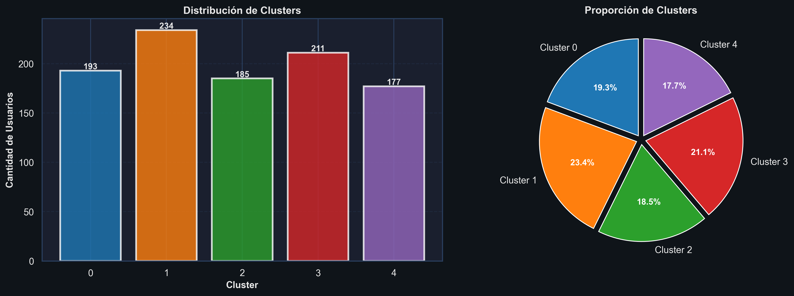

Conteo absoluto (barras) y proporción (pie chart) de usuarios en cada uno de los 5 clusters.

La distribución es bastante equitativa:
- **Cluster 1**: 234 usuarios (23.4%) — el más grande
- **Cluster 3**: 211 usuarios (21.1%)
- **Cluster 0**: 193 usuarios (19.3%)
- **Cluster 2**: 185 usuarios (18.5%)
- **Cluster 4**: 177 usuarios (17.7%) — el más pequeño

La diferencia entre el cluster más grande y el más pequeño es de solo 57 usuarios (5.7 puntos porcentuales). Esto es un resultado positivo del KMeans: no generó clusters degenerados donde la mayoría de usuarios cae en uno solo.

---

### 16. Características por Cluster
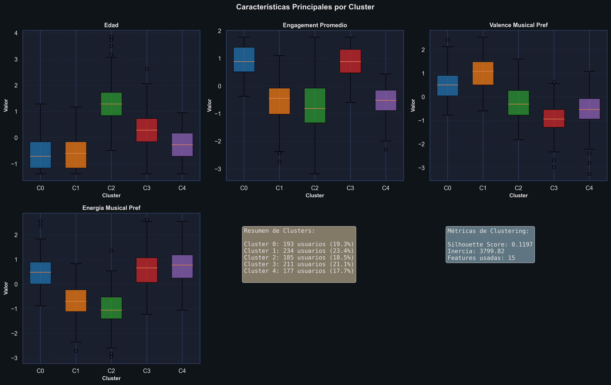

Boxplots de las 4 features numéricas más interpretables para cada cluster, más cuadros resumen con tamaño de clusters y métricas de calidad.

Los valores están normalizados (media 0, desviación 1), por lo que los valores positivos indican "más que el promedio" y los negativos "menos que el promedio":

- **`Edad`**: C2 tiene la mediana más alta (usuarios mayores), mientras que C0 y C1 tienen medianas negativas (usuarios jóvenes). Hay una separación bastante clara entre clusters en esta variable, siendo una de las más discriminativas.

- **`Engagement Promedio`**: C0 y C3 tienen engagement alto (medianas cerca de 1), mientras que C2 tiene engagement bajo o negativo. C1 también tiene engagement elevado. Esto sugiere que la edad y el engagement van en direcciones opuestas.

- **`Valence Musical Pref`**: C2 tiene la mediana de valence más alta (prefieren música más positiva/alegre), mientras que C3 y C4 prefieren música menos alegre.

- **`Energia Musical Pref`**: C2 tiene energía baja, lo que junto con la valence alta podría indicar un perfil de usuario mayor que prefiere música tranquila pero melódica. C0 y C1 tienen energía más alta en promedio.

---

### 17. Elbow + Silhouette — Selección de K
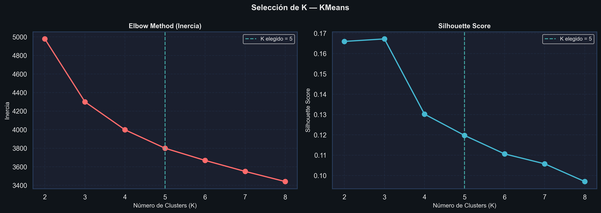

Gráficos de inercia (Elbow Method) y Silhouette Score para K de 2 a 8, con una línea vertical marcando el K=5 elegido.

- **Elbow (izquierda)**: La inercia cae de forma pronunciada desde K=2 hasta K=5. A partir de K=5 la curva empieza a aplanarse notablemente, lo que indica que agregar más clusters ya no reduce la compacidad intra-cluster de forma significativa. El codo del método está visualmente entre K=4 y K=5, lo que justifica la elección de K=5.

- **Silhouette (derecha)**: El score más alto está en K=2 (0.168) y K=3, luego cae progresivamente. Esto puede interpretarse como que los datos tienen naturalmente 2-3 grupos grandes, y al subdividirlos a 5 se pierde algo de separación. Sin embargo, K=5 ofrece clusters más descriptivos e interpretables que K=2, que daría grupos demasiado generales. La decisión de usar K=5 fue una elección interpretativa, no estrictamente matemática.

---

### 18. Varianza Explicada Acumulada — PCA
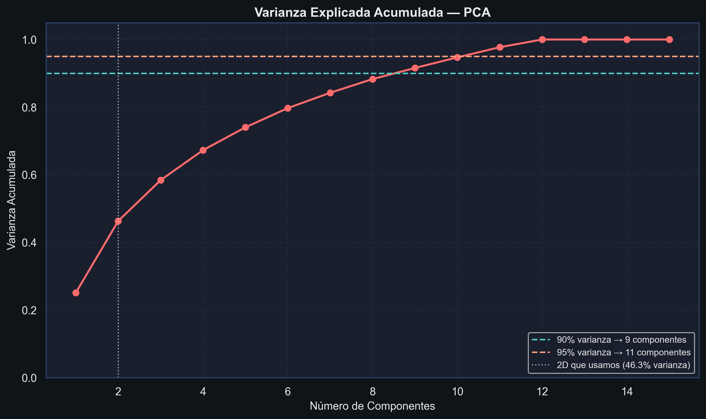

Curva de varianza explicada acumulada al agregar componentes principales uno a uno. Las líneas de referencia marcan los umbrales del 90% y 95% de varianza.

- **2 componentes** (los que usamos para visualizar clusters): explican solo el **46.3%** de la varianza. Esto confirma que los gráficos PCA 2D pierden más de la mitad de la información del espacio original.
- **9 componentes** son necesarios para capturar el **90%** de la varianza del dataset.
- **11 componentes** son necesarios para llegar al **95%** de la varianza, sobre un total de 15 features.

Esto implica que el dataset tiene información relativamente distribuida entre todas sus features: no hay 2-3 variables que "lo expliquen todo". Cada feature aporta algo, lo que es positivo para los modelos supervisados (más señal útil) pero explica por qué las visualizaciones 2D tienen tanto solapamiento entre clusters.

---

### 19. Perfil Normalizado por Cluster
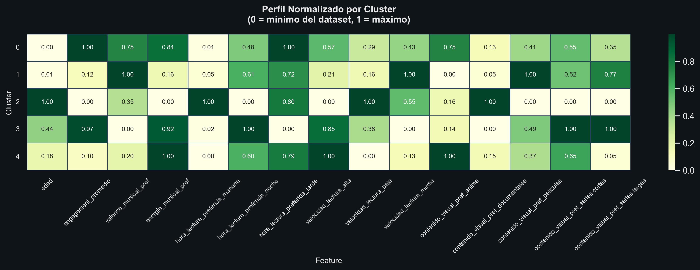

Heatmap con el promedio normalizado (0 = mínimo del dataset, 1 = máximo) de cada feature para cada cluster. Permite describir con palabras el perfil de cada grupo de usuarios.

Leyendo el heatmap por filas, se puede construir el "retrato" de cada cluster:

- **Cluster 0 — Jóvenes activos de tarde**: Edad muy baja (0.00), engagement muy alto (1.00), prefieren la tarde para leer (1.00), alta energía y valence musical, les gusta el anime (0.75) y las series cortas (0.55).

- **Cluster 1 — Jóvenes nocturnos cinéfilos**: Edad muy baja, valence musical muy alta (1.00) pero energía baja (0.16), leen de noche y tarde, velocidad media (1.00), ven muchas películas (1.00) y series largas (0.77). Probablemente usuarios que prefieren contenido tranquilo pero extenso.

- **Cluster 2 — Mayores mañaneros documentalistas**: Edad muy alta (1.00), engagement muy bajo (0.00), energía musical muy baja (0.00), leen por las mañanas (1.00), velocidad de lectura baja (1.00), ven exclusivamente documentales (1.00). El perfil más diferenciado de todos.

- **Cluster 3 — Adultos nocturnos de alta energía**: Engagement muy alto (0.97), valence musical muy baja (0.00) pero energía muy alta (0.92), leen de noche (1.00), velocidad alta (0.85), ven tanto series cortas (1.00) como largas (1.00). Perfil de usuario intenso y activo.

- **Cluster 4 — Jóvenes otakus veloces**: Edad baja, energía musical máxima (1.00), velocidad de lectura muy alta (1.00), son los mayores consumidores de anime (1.00). Leen de tarde/noche y prácticamente no ven series largas (0.05).

---

### 20. Distribución de Targets por Cluster
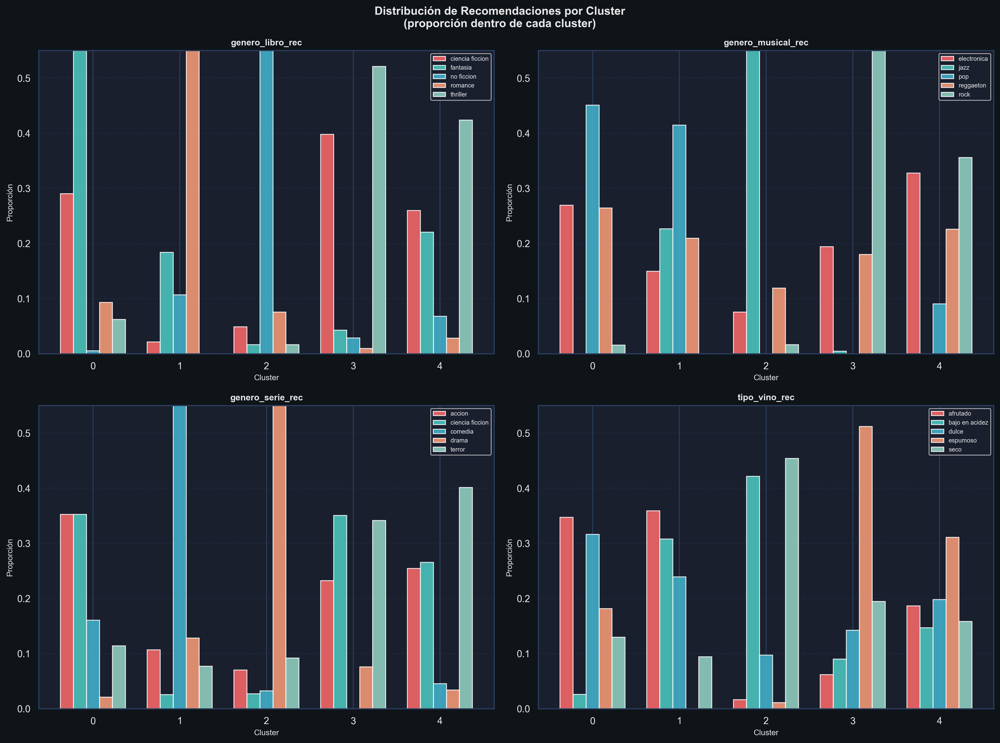

Barras agrupadas que muestran qué proporción de cada cluster cae en cada clase de los 4 recomendadores. Es la gráfica más importante del clustering porque conecta los grupos de usuarios con las recomendaciones que reciben.

Si los clusters capturan perfiles reales, deberían tener distribuciones de targets distintas entre sí. Y efectivamente se ven patrones claros:

- **`genero_libro_rec`**:
  - Cluster 0 (jóvenes activos): domina ciencia ficción (~0.30) y fantasía (~0.20).
  - Cluster 2 (mayores mañaneros): domina **no ficción de forma aplastante** (~0.55). Tiene todo el sentido dado su perfil.
  - Cluster 3 (adultos nocturnos): concentra ciencia ficción alta (~0.40).
  - Clusters 1 y 4: mezcla de thriller y romance.

- **`genero_musical_rec`**:
  - Cluster 1 (cinéfilos tranquilos): **jazz domina claramente** (~0.45). Su valence alta y energía baja se alinea perfectamente con el jazz.
  - Cluster 4 (otakus veloces): **rock domina** (~0.35+), consistente con su energía musical máxima.
  - Cluster 0: electronica y jazz en proporciones similares.

- **`genero_serie_rec`**:
  - Cluster 2 (mayores mañaneros): **comedia domina con ~0.50**. Es el grupo con la preferencia más clara.
  - Cluster 4 (otakus): drama alto (~0.40), lo cual es interesante dado su perfil.
  - Cluster 0 (jóvenes activos): acción y ciencia ficción en partes iguales.

- **`tipo_vino_rec`**:
  - Cluster 3 (alta energía, nocturnos): **espumoso domina con ~0.50**. Consistente con su perfil de usuario intenso y social.
  - Cluster 2 (mayores tranquilos): **dulce domina** (~0.40+), lo que tiene sentido con su preferencia por música tranquila.
  - Cluster 0: afrutado y bajo en acidez en proporciones similares.

Estos patrones validan que el clustering capturó grupos de usuarios con comportamientos diferenciados, incluso si el Silhouette Score es bajo. La separación existe, solo que es gradual y no tiene bordes duros.
